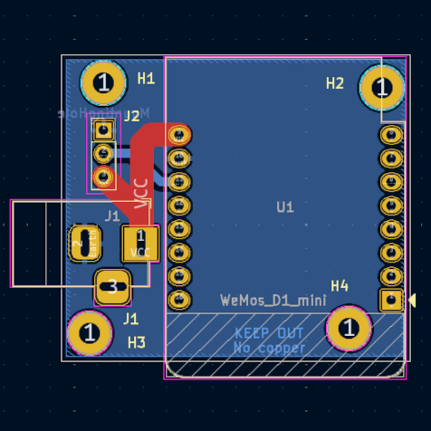
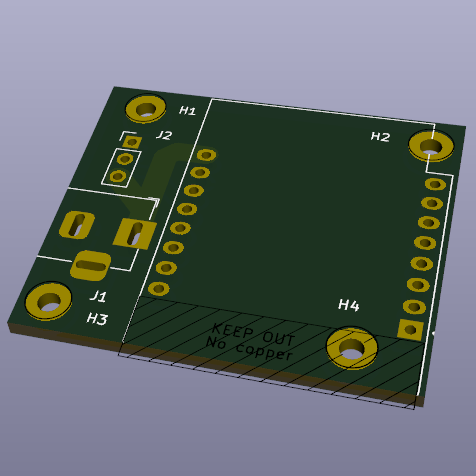
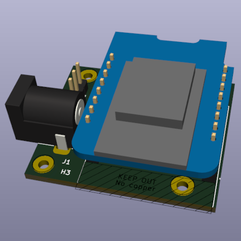

# Welcome to the project of open source pixel bar !

The project goal is to create an Astera like Pixel bar, that is easy to build and customize to your need !

It work around Wemos D1 esp8266 and feature a custom shield and enclosure to plug on a aluminium profile. We are using [Wled library](https://github.com/wled/WLED) to run the project !

## List of components

- Wemos D1 [Aliexpress](https://fr.aliexpress.com/item/1005007877904928.html?spm=a2g0o.productlist.main.1.4bd667c0TEfidm&algo_pvid=c34ee053-ded5-45b6-a7a7-0a01593a1252&algo_exp_id=c34ee053-ded5-45b6-a7a7-0a01593a1252-0&pdp_ext_f=%7B%22order%22%3A%223476%22%2C%22eval%22%3A%221%22%7D&pdp_npi=4%40dis%21EUR%212.44%212.44%21%21%212.70%212.70%21%40210385db17443728523754661ecd67%2112000042669746256%21sea%21FR%211895049685%21X&curPageLogUid=ZyYnmMF8z4aX&utparam-url=scene%3Asearch%7Cquery_from%3A)
- 8 x 3D printing insert M3, 3.5mm X 3.5mm [Aliexpress](https://www.aliexpress.com/item/1005003582355741.html?spm=a2g0o.order_list.order_list_main.22.22381802C50TZI)
- 8 x M2 4mm long Screw [Aliexpress](https://fr.aliexpress.com/item/32810872544.html?spm=a2g0o.order_list.order_list_main.16.22381802C50TZI&gatewayAdapt=glo2fra)
- WS2812B eco led strip 1M, 60 leds IP67
- Led Aluminium profile (See section below)
- Custom Shield (See section below)
- 3D print box (See section below)

### Led Aluminium profile

The led aluminiun profile should have the following shape and be 1 meter long :

 

It can be found on Amazon, but if you send me message I may get them for you cheaper as I order in bulk ! 

### Custom shield for Wemos D1

The shield consist of a simple PCB that route power from the a Barrel jack input to the Wemos D1 and to the led strip with a jst connector.

The shield can be ordered online, you then need to solder :

 - Barrel Type DC Connector  [Aliexpress](https://www.aliexpress.com/item/4001206395694.html?spm=a2g0o.order_list.order_list_main.89.571b1802pOpXx)
- 2.54mm pin connector
- Female 8 Pin Header Socket

The 4 mounting Hole H1-H4 are for mounting to the 3D Print case

The kicad project with PCB layout and schematic is available as a zip named Wemos D1 shield

If needed, contact me, I can send you the ready to plug PCB for a small price !

### 3D print box

  
  

## Licence

Shield: [![CC BY-NC-SA 4.0][cc-by-nc-sa-shield]][cc-by-nc-sa]

This work is licensed under a
[Creative Commons Attribution-NonCommercial-ShareAlike 4.0 International License][cc-by-nc-sa].

[![CC BY-NC-SA 4.0][cc-by-nc-sa-image]][cc-by-nc-sa]

[cc-by-nc-sa]: http://creativecommons.org/licenses/by-nc-sa/4.0/
[cc-by-nc-sa-image]: https://licensebuttons.net/l/by-nc-sa/4.0/88x31.png
[cc-by-nc-sa-shield]: https://img.shields.io/badge/License-CC%20BY--NC--SA%204.0-lightgrey.svg
